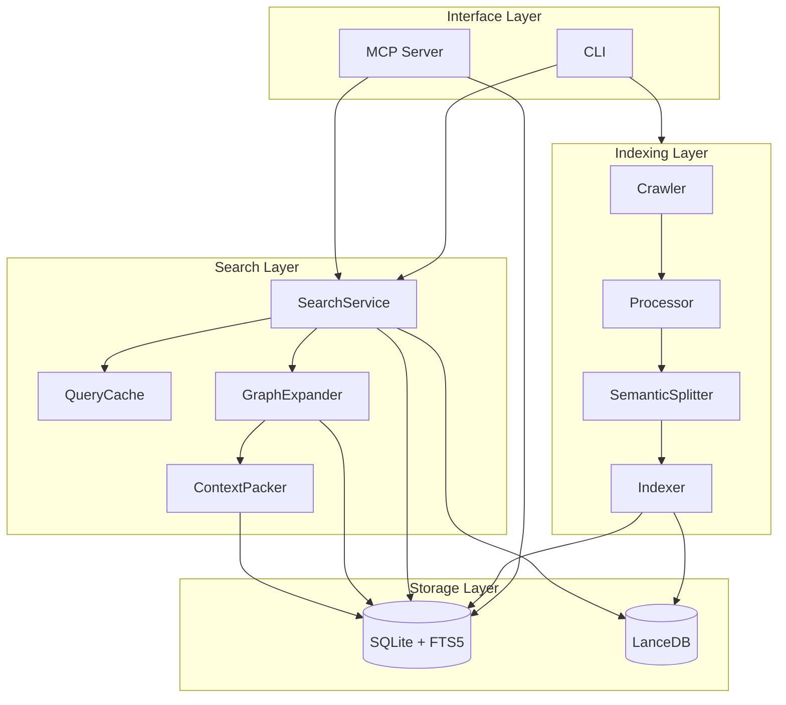

# Architecture Overview

ContextWeaver is organized into four layers: interface, indexing, storage, and search.

## Interface layer

| File | Responsibility |
|------|----------------|
| `src/index.ts` | CLI entrypoint; registers `init/index/watch/search/mcp/migrate/stats` commands |
| `src/mcp/server.ts` | MCP server; registers tools and handles protocol calls |
| `src/cli/mirrorCommands.ts` | Mirrors selected MCP tools as CLI commands |

## Indexing layer

The indexing layer reads source files, filters low-value files, computes hashes, chunks code, and writes indexes.

| File | Responsibility |
|------|----------------|
| `src/scanner/crawler.ts` | Traverses the filesystem with `fdir` |
| `src/scanner/filter.ts` | Applies default ignore rules and `IGNORE_PATTERNS` |
| `src/scanner/processor.ts` | Reads files, detects encoding, and computes hashes |
| `src/chunking/SemanticSplitter.ts` | AST semantic chunking and fallback line chunking |
| `src/indexer/index.ts` | Batch embedding, LanceDB writes, FTS writes, and SQLite marks |

## Storage layer

ContextWeaver uses two storage systems:

- SQLite: file metadata, full content, FTS5, statistics, migration state, and outbox
- LanceDB: vectors and locating metadata

Since v1.4.0, source content only lives in SQLite `files.content`; LanceDB no longer stores `display_code` or `vector_text`.

## Search layer

The search layer builds final context packs from user queries.

| File | Responsibility |
|------|----------------|
| `src/search/SearchService.ts` | Hybrid retrieval, RRF, rerank, Smart TopK, and stats recording |
| `src/search/QueryCache.ts` | Per-project LRU query cache |
| `src/search/GraphExpander.ts` | E1/E2/E3 context expansion |
| `src/search/ContextPacker.ts` | Segment merging and token-budget control |
| `src/search/ChunkContentLoader.ts` | Slices content from `files.content` |
| `src/search/fts.ts` | File-level and chunk-level FTS search |

## Where to make changes

- Change file discovery: `scanner/`
- Change chunking: `chunking/`
- Change index writes: `indexer/`, `db/`, `vectorStore/`
- Change retrieval: `search/SearchService.ts`
- Change expansion: `GraphExpander.ts` and `resolvers/`
- Change tools exposed to agents: `mcp/tools/`
