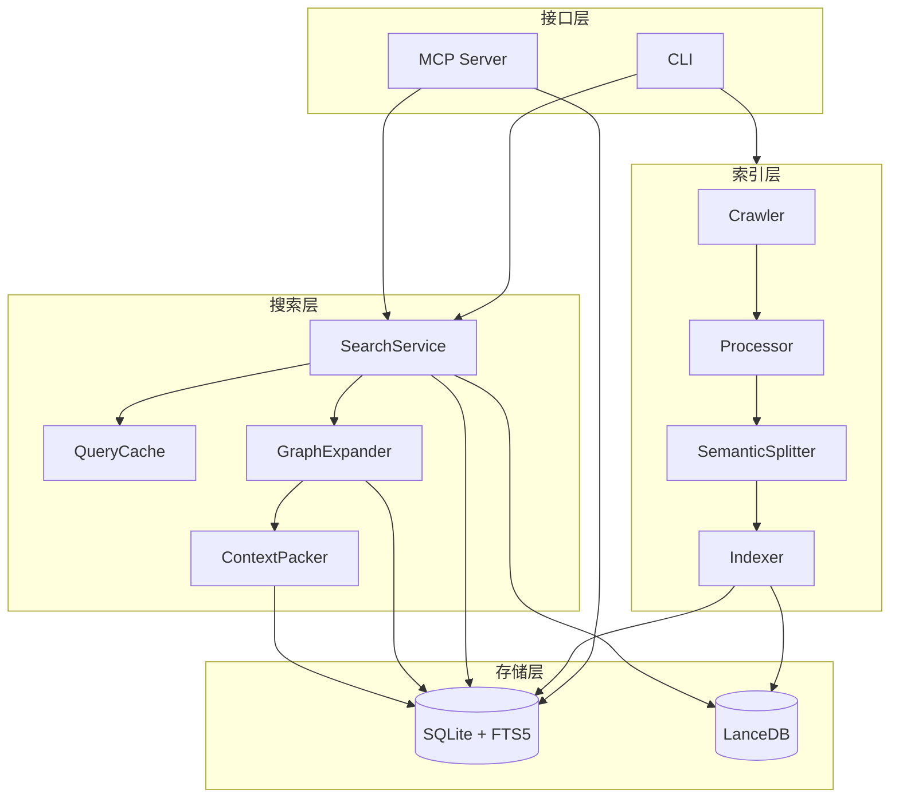

# 架构总览

ContextWeaver 的架构可以分为四层：接口层、索引层、存储层和搜索层。

## 接口层

| 文件 | 职责 |
|------|------|
| `src/index.ts` | CLI 入口，注册 `init/index/watch/search/mcp/migrate/stats` 等命令 |
| `src/mcp/server.ts` | MCP 服务端，注册工具并处理 MCP 协议调用 |
| `src/cli/mirrorCommands.ts` | 将部分 MCP 工具镜像为 CLI 命令 |

## 索引层

索引层负责从文件系统读取源码，过滤无价值文件，计算 hash，分片并写入索引。

| 文件 | 职责 |
|------|------|
| `src/scanner/crawler.ts` | 基于 `fdir` 遍历文件系统 |
| `src/scanner/filter.ts` | 应用默认忽略规则与 `IGNORE_PATTERNS` |
| `src/scanner/processor.ts` | 读取文件、检测编码、计算 hash |
| `src/chunking/SemanticSplitter.ts` | AST 语义分片与 fallback 行分片 |
| `src/indexer/index.ts` | 批量 embedding、写 LanceDB、写 FTS、更新 SQLite mark |

## 存储层

ContextWeaver 使用 SQLite 和 LanceDB 组成双存储：

- SQLite：文件元数据、完整正文、FTS5、统计、迁移状态、outbox
- LanceDB：向量与定位元数据

v1.4.0 起，正文只存在 SQLite 的 `files.content`，LanceDB 不再保存 `display_code/vector_text`。

## 搜索层

搜索层负责从用户查询构建最终上下文包。

| 文件 | 职责 |
|------|------|
| `src/search/SearchService.ts` | 混合检索、RRF、Rerank、Smart TopK、统计记录 |
| `src/search/QueryCache.ts` | per-project LRU 查询缓存 |
| `src/search/GraphExpander.ts` | E1/E2/E3 上下文扩展 |
| `src/search/ContextPacker.ts` | 合并片段并控制 token 预算 |
| `src/search/ChunkContentLoader.ts` | 从 `files.content` 批量切片 |
| `src/search/fts.ts` | 文件级与 chunk 级 FTS 搜索 |

## 二开时的判断原则

- 修改“如何扫描文件”：优先看 `scanner/`
- 修改“如何切 chunk”：优先看 `chunking/`
- 修改“如何写索引”：优先看 `indexer/`、`db/`、`vectorStore/`
- 修改“如何搜”：优先看 `search/SearchService.ts`
- 修改“如何扩展上下文”：优先看 `GraphExpander.ts` 和 `resolvers/`
- 修改“暴露给 Agent 的工具”：优先看 `mcp/tools/`
